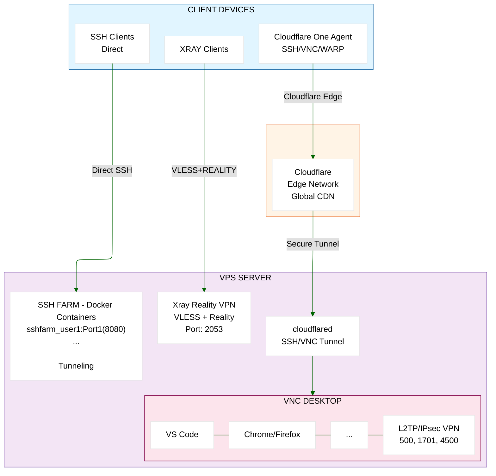

# Secure Remote Access Gateway with Cloudflare Zero Trust

**Secure access solution combining Cloudflare Zero Trust for SSH/VNC access, Xray Reality VPN for bypassing DPI filtering, SSH Farm with SSH tunneling, and L2TP for app-specific routing in VNC sessions.**

---

## Architecture Overview

This setup provides comprehensive secure remote access:

- **Cloudflare Zero Trust**: Identity-aware SSH/VNC access management
- **Xray Reality VPN**: VLESS + Reality protocol for bypassing DPI filtering (ideal for Iran)
- **SSH Farm**: Multiple SSH servers with SSH tunneling support (for VPN apps like NekoBox)
- **L2TP/IPsec VPN**: Application-specific routing for VPN_APPS in VNC sessions

<div style="background-color: #E3F2FD; padding: 20px; border-radius: 5px;">



</div>


## ACCESS METHODS & PORTS:
- SSH/VNC Access (via Cloudflare):
   → Client → Cloudflare Edge → cloudflared → localhost:22 (SSH) / :5910+ (VNC)
   
- Xray Reality VPN (Anti-DPI):
   → Port 2053 (TCP) → VLESS + Reality → Bypasses DPI filtering
   
- L2TP/IPsec VPN Server:
   → Ports 500 (UDP), 1701 (UDP), 4500 (UDP) → App-specific routing in VNC
   
- SSH Farm (Direct Access - SSH Tunneling):
   - Ports 8080, 8880, 2052, 2082, 2086, 2095, 9443, 2083, 2087, 2096...
   - SSH tunneling enabled (AllowTcpForwarding, PermitTunnel)
   - Use with NekoBox, OpenVPN, or any SSH tunnel-based VPN
   - Users: sshfarm_user1, sshfarm_user2, sshfarm_user3...

---

## Prerequisites

- **VPS**: Ubuntu 24.04 with public IP
- **Cloudflare Account**: Free tier (for Zero Trust Access)
- **Email**: Gmail address for authentication
- **Clients**: Cloudflare One Agent for SSH/VNC, v2rayNG for Xray, NekoBox for SSH tunneling

---

## Part 1: Cloudflare Zero Trust Setup (Dashboard Configuration)
Cloudflare One Agent for SSH/VNC access
### 1.1 Configure Identity Provider

Set up authentication method for your users:

1. Go to [Cloudflare Zero Trust Dashboard](https://one.dash.cloudflare.com/)
2. Navigate to: **Integrations → Identity providers**
4. Click **Add an identity provider**
5. Select **One-time PIN**
6. Click **Save**

**Result**: Users can now authenticate using email + OTP (one-time PIN sent to their email)

---

### 1.2 Configure Device Enrollment/Connection Policy

Allow authorized users to enroll/connect their devices:

1. Go to: **Team & Resources → Devices → Management**
2. Under **Device enrollment**, ensure these settings:
   - **Device enrollment permissions**: Select **Manage**
3. Under **Access policies**, click **Create new policy**
4. Configure Policy:
   - **Policy name**: `Admin Policy`
   - **Selector**: `Emails`
   - **Value**: `user1@gmail.com`
5. Click **Save**

Note: include this policy in the **Device enrollment permissions**

---

### 1.3 Create Cloudflare Tunnel

1. Go to: **Networks → Connectors → Cloudflare Tunnels**
2. Click **Create a tunnel**
3. Select **Cloudflared** (NOT WARP Connector)
4. **Tunnel name**: `vps-access`
5. Click **Save tunnel**
6. Select **Linux** as the operating system
7. You'll see installation commands - **copy the token** from the command
   
   Example command:
   ```bash
   cloudflared service install <YOUR-TOKEN-HERE>
   ```
   
   **Copy only the token part** (long string starting with `eyJ...`)
8. **Save this token** - you'll add it to `workstation.env` as `CLOUDFLARE_TUNNEL_TOKEN`
9. Click **Next**
10. **Important**: Add any public hostname routes then delete it (we'll add applications later)
11. Click **Next** again to finish
**Result**: Tunnel created and ready for configuration on VPS

---

### 1.4 Create Access Application for SSH

Configure SSH access through Cloudflare Access:

1. Go to: **Access controls → Applications**
2. Click **Add an application**
3. Select **Self-hosted**
4. Configure the application:
   - **Application name**: `ssh`
   - **Session Duration**: `24 hours` (or your preference)
   - **Public hostname**:
     - Subdomain: `ssh`
     - Domain: Select your team domain from dropdown
     - Path: Leave empty
   - **Browser rendering settings**: select `SSH` for Browser rendering.
   - Click **Next**

5. Add an Access policy:
   - Click **Select** next to the policy dropdown
   - Select your existing **Admin Policy** (the one you created earlier)
   - Click **Next**

6. Additional settings (optional):
   - Leave default settings
   - Click **Add application**

**Result**: SSH application created and protected by your Admin Policy

---

### 1.5 Create Access Application for VNC

If you want to access VNC through Cloudflare (recommended):

**For each VNC user, create a separate application:**

1. Go to: **Access controls → Applications**
2. Click **Add an application**
3. Select **Self-hosted**
4. Configure the application:
   - **Application name**: `VPS VNC User 1` (or specific username)
   - **Session Duration**: `24 hours`
   - **Application domain**:
     - Subdomain: `vnc1` (use vnc2, vnc3 for additional users)
     - Domain: Select your team domain
   - **Browser rendering settings**: select `VNC` for Browser rendering.
   - Click **Next**

5. Add an Access policy:
   - Click **Select** next to the policy dropdown
   - Select your existing **Admin Policy**
   - Or create a new policy if needed
   - Click **Next**

6. Additional settings:
   - Leave default settings
   - Click **Add application**

7. **Repeat steps 1-6** for each VNC user (User 2 on port 5911, User 3 on port 5912, etc.)

**Result**: Each VNC session has its own protected access application

---

### 1.6 Configure Tunnel Routes for Applications

Now connect your tunnel to the applications you created:

1. Go to: **Networks → Connectors**
2. Click on your tunnel name (`vps-access`)
3. Click **Configure**
4. Go to **Published application routes** tab
5. Click **Add a published application route**

**For SSH Application:**
   - **Subdomain**: `ssh` (must match the subdomain from step 1.4)
   - **Domain**: Select your team domain
   - **Path**: Leave empty
   - **Type**: `SSH`
   - **URL**: `localhost:22`
   - Click **Save hostname**

**For VNC Applications (repeat for each VNC user):**
6. Click **Add a public hostname** again
   - **Subdomain**: `vnc1` (for first VNC user)
   - **Domain**: Select your team domain
   - **Path**: Leave empty
   - **Type**: `TCP`
   - **URL**: `localhost:5910` (port 5910 for first user, 5911 for second, etc.)
   - Click **Save hostname**

7. Repeat step 6 for additional VNC users with different subdomains (vnc2, vnc3) and ports (5911, 5912)

**Result**: Your tunnel now routes traffic from Cloudflare to your VPS services

---

## Part 2: VPS Server Setup

### 2.1 Prepare VPS Configuration

1. **SSH into your VPS**:
   ```bash
   ssh root@YOUR_VPS_IP
   ```

2. **Clone this repository and edit `workstation.env`**:
   ```bash
   git clone https://github.com/HosseinBeheshti/setupWS.git
   cd setupWS
   vim workstation.env
   ```

3. **Configure required settings** in `workstation.env`:
   - `CLOUDFLARE_TUNNEL_TOKEN`: Your tunnel token from Part 1.3
   - `VPS_PUBLIC_IP`: Your VPS public IP address
   - `VNCUSER*_PASSWORD`: Set strong passwords for VNC users
   - `L2TP_*`: L2TP VPN credentials if using VPN_APPS routing
   - `SSH_FARM_PORTS`: Comma-separated list of ports for SSH servers
   - `SSH_FARM_PASSWORD`: Auto-generated if not set (or set your own)
   - `XRAY_LISTENING_PORT`: Xray VPN port (default: 2053)
   - `FIREWALL_ALLOWED_PORTS`: Ports to allow through firewall
     - Default: `500/udp,1701/udp,4500/udp,2053/tcp` (L2TP + Xray)
     - Leave empty for Cloudflare tunnel-only access (most secure)

4. **Save and exit** (`:wq` in vim)

---

### 2.2 Run Automated Setup

**Run the master setup script** (installs everything in correct order):

```bash
./setup_ws.sh
```

**What this does:**
1. Installs all required packages (VNC, L2TP, Docker, VS Code, Chrome, etc.)
2. Configures virtual router for VPN traffic
3. Sets up L2TP/IPsec for VPN_APPS routing in VNC sessions
4. Creates VNC servers for each user
5. Installs cloudflared and configures Cloudflare tunnel for secure access
6. Sets up Xray Reality VPN (VLESS + Reality protocol)
7. Deploys SSH Farm with SSH tunneling (multiple SSH servers)
8. Configures secure firewall with custom port rules from workstation.env

**Duration**: 10-15 minutes depending on VPS speed.

**Monitor progress** - the script provides detailed status messages.

---

## Part 3: Client Setup

```bash
# Add cloudflare gpg key
sudo mkdir -p --mode=0755 /usr/share/keyrings
curl -fsSL https://pkg.cloudflare.com/cloudflare-public-v2.gpg | sudo tee /usr/share/keyrings/cloudflare-public-v2.gpg >/dev/null

# Add this repo to your apt repositories
echo 'deb [signed-by=/usr/share/keyrings/cloudflare-public-v2.gpg] https://pkg.cloudflare.com/cloudflared any main' | sudo tee /etc/apt/sources.list.d/cloudflared.list

# install cloudflared
sudo apt-get update && sudo apt-get install cloudflared
```

### 3.1 Connect to VNC Desktop

**use VNC client with cloudflared:**
```bash
# Install cloudflared on client machine
# Create local tunnel to VNC
cloudflared access tcp --hostname vnc1.yourdomain.org --url localhost:5900

# In another terminal, connect VNC client to localhost:5900
```

Or use web application `https://vnc1.yourdomain.org`

**Direct Connection:**

**Not Available** - Direct VNC access is blocked by firewall for security. You must use Cloudflare Access.

---

### 3.2 Access via SSH

1. **SSH via cloudflared**:
    ```bash
    cloudflared access ssh --hostname ssh.yourdomain.org --url localhost:2222
    ```

    ```bash
    ssh -p 2222 username@localhost
    ```
    Or use web application `https://ssh.yourdomain.org`

**Direct SSH:**

**Not Available** - Direct SSH access is blocked by firewall for security. You must use Cloudflare Access.

---

### 3.3 Use L2TP for VPN_APPS in VNC Sessions

L2TP is configured to route specific applications through a remote VPN.
This is useful when working in a VNC session and need certain apps routed.

**In your VNC session:**
```bash
sudo ./run_vpn.sh
```

This will:
- Connect to L2TP VPN server
- Route traffic from VPN_APPS (e.g., xrdp, remmina) through L2TP
- Keep other VNC session traffic using normal routing

**Note:** is a separate independent VPN service for your client devices.
L2TP is only for routing specific apps in VNC sessions.

---

---

## Firewall Configuration

The setup includes a centralized firewall configuration via `setup_fw.sh`:

### Default Configuration
- **All incoming ports blocked** except those specified in `FIREWALL_ALLOWED_PORTS`
- **L2TP/IPsec ports**: UDP 500, 1701, 4500 (for L2TP VPN)
- **Xray Reality VPN**: Port 2053 TCP (for VLESS + Reality)
- **SSH Farm**: Ports 8080, 8880, 2052, etc. (automatically opened)
- **SSH/VNC access**: Only through Cloudflare tunnel (most secure)

### Customizing Firewall Rules

Edit `FIREWALL_ALLOWED_PORTS` in `workstation.env`:

```bash
# Examples:
# Default (L2TP + Xray):
FIREWALL_ALLOWED_PORTS="500/udp,1701/udp,4500/udp,2053/tcp"

# With SSH Farm ports (automatically added by setup_sshfarm.sh):
FIREWALL_ALLOWED_PORTS="500/udp,1701/udp,4500/udp,2053/tcp,8080/tcp,8880/tcp,2052/tcp"

# Xray only:
FIREWALL_ALLOWED_PORTS="2053/tcp"

# SSH Farm only:
FIREWALL_ALLOWED_PORTS="8080/tcp,8880/tcp,2052/tcp,2082/tcp"

# Cloudflare tunnel-only (most secure, no direct access):
FIREWALL_ALLOWED_PORTS=""
```

### Manual Firewall Changes

To reconfigure firewall after initial setup:
```bash
sudo ./setup_fw.sh
```

### Security Notes
- Direct SSH/VNC access is **always blocked** for security
- All SSH/VNC access **must go through Cloudflare tunnel**
- L2TP ports (500, 1701, 4500) are opened for L2TP VPN connectivity
- Xray port (2053) is opened for Reality VPN access
- SSH Farm ports are automatically opened by setup script
- Modify `FIREWALL_ALLOWED_PORTS` only if you need additional services

---

## SSH Farm with SSH Tunneling

Multiple SSH servers for load distribution with SSH tunneling support (for VPN apps).

### Features

- **Multiple SSH servers**: One container per configured port
- **SSH Tunneling Enabled**: AllowTcpForwarding, PermitTunnel for VPN apps
- **Shared password**: Auto-generated or set manually (same for all users)
- **Unique usernames**: sshfarm_user1, sshfarm_user2, etc.
- **Compatible with**: NekoBox, OpenVPN, any SSH tunnel-based VPN client

### Configuration

Edit `workstation.env`:

```bash
SSH_FARM_PORTS="8080,8880,2052,2082,2086,2095,9443"
SSH_FARM_PASSWORD="your_strong_password"
```

### Management

```bash
# Start all SSH servers
docker compose -f docker-compose-sshfarm.yml up -d

# Stop all servers
docker compose -f docker-compose-sshfarm.yml down

# View logs
docker compose -f docker-compose-sshfarm.yml logs -f

# Check status
docker compose -f docker-compose-sshfarm.yml ps
```

### Connect

```bash
# Direct SSH connection
ssh -p 8080 sshfarm_user1@your-server-ip

# Create SOCKS5 tunnel (for use as VPN)
ssh -p 8080 -D 1080 -N sshfarm_user1@your-server-ip

# Use with NekoBox:
# - Type: SSH
# - Server: your-server-ip
# - Port: 8080 (or any farm port)
# - Username: sshfarm_user1
# - Password: (from setup output)
```

---

## 
## License

See [LICENSE](LICENSE) file.

---

**Setup completed!** Enjoy your secure remote access gateway with VPN and Cloudflare Zero Trust Access.
